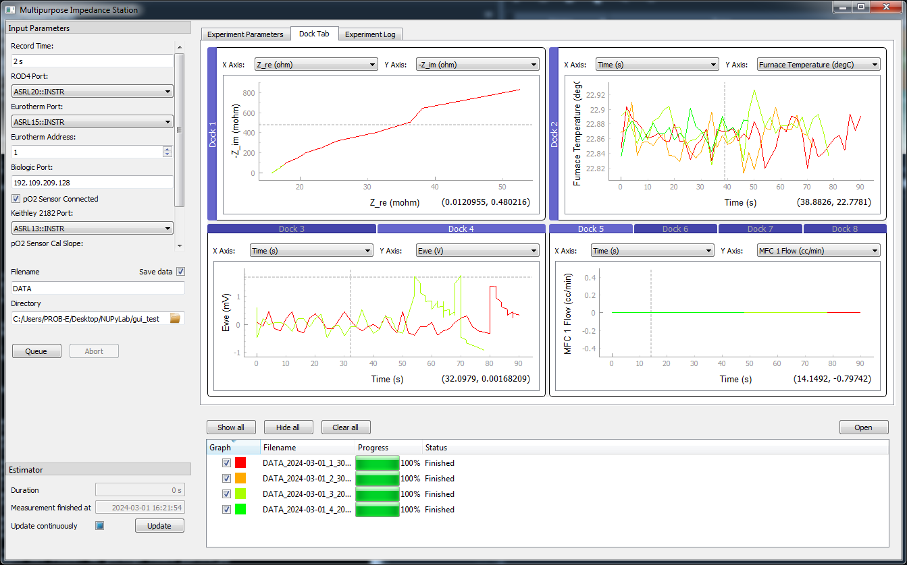
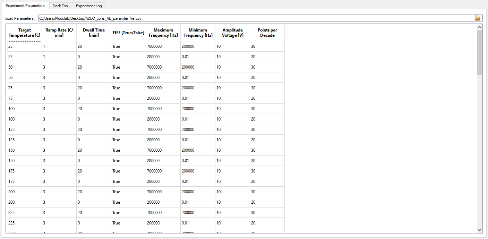

#####################
Running an Experiment
#####################

Quick Start
===========

Assuming you have a working installation of NUPyLab and code for your station
already exists, there are a few options to quickly get your code running.

1. From AnacondaPrompt, activate the environment with NUPyLab and run the GUI file for your station:

.. code-block:: bash

    conda activate nupylab
    cd <path/to/gui_folder>
    python your_gui.py

2. Create a `batch` file to easily activate conda and run your python script.
Then you can just double-click the file to run the station code.

**example.bat**

.. code-block:: batch

    @echo OFF
    rem Define the path to your conda installation
    set CONDAPATH=C:\Users\<username>\Miniconda3
    set ENVPATH=%CONDAPATH%\envs\nupylab
    call %CONDAPATH%\Scripts\activate.bat %ENVPATH%
    rem Run a python script in that environment
    python path\to\script.py
    rem Deactivate the environment
    call conda deactivate

3. With your NUPyLab environment activated, run the script directly from a code
editor.

Running a GUI
=============

The standard NUPyLab station GUI consists of three panes:

* Experiment parameters table
* Docked live-plotting frames
* Experiment log

Additionally, instrument connection settings are configured at the left-hand
side, and a data browser is shown at the bottom. To get started running a
measurement, set the appropriate instrument connection settings and enter your
measurement parameters in the parameter table. Each row represents a single
experiment step. Parameters can be loaded from and saved to file. Rows can also
be added or deleted directly from the GUI.

Once all parameters have been entered, press :code:`Queue` to start the
experiment. All steps will be loaded in and run sequentially. Experiment
progress can be monitored from live plotting frames and the experiment log. The
experiment will stop and run each instrument's shutdown method upon finishing
all steps, if an error occurs, or if the :code:`Abort` button is pressed.