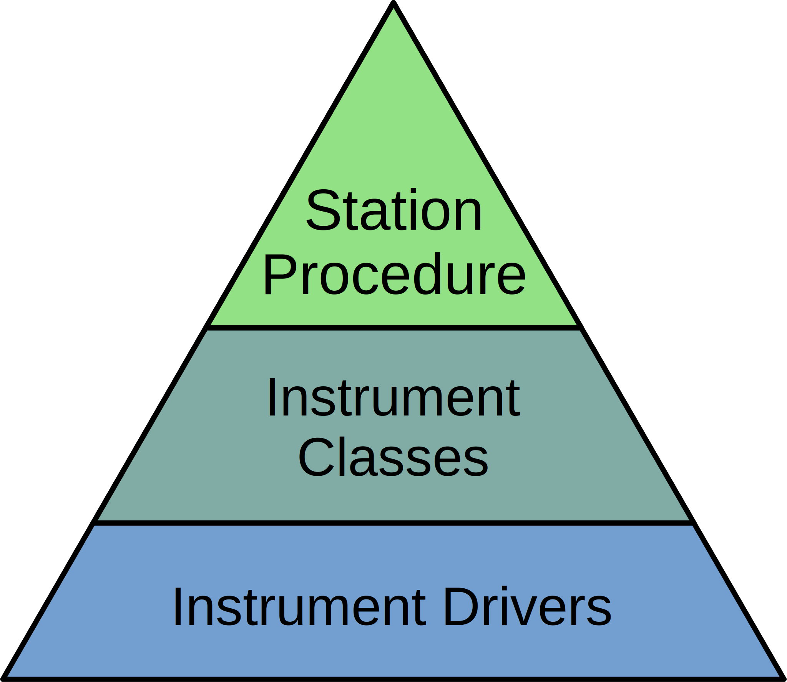

##########################
Creating a New Station GUI
##########################

Each station GUI consists of three components:

* Low-level `drivers <Drivers_>`_ for communicating with connected instruments
* Mid-level `instrument classes <Instrument Classes_>`_ that adapt drivers to
  the requirements of a NUPyLab procedure
* A high-level `procedure <Procedures_>`_ that executes the steps of an
  experiment

Drivers
=======

Drivers are the base and the most important component for creating a station
GUI. Getting a new station up and running starts with creating or obtaining
drivers for each instrument. The types of drivers generally fall into three
camps:

1. Text-based communication over a serial connection, which may adhere to a
   protocol like SCPI or some other format. Examples:

    * Proterial ROD-4A MFC Controller
    * Keithely 2182A Nanovoltmeter
    * Agilent 4284A LCR Meter

2. Serial communication by a non-text protocol. Examples:
    * Eurotherm (MODBUS protocol)
    * Omron (CompoWay/F protocol)

3. Communication by a pre-compiled library. Examples:
    * Biologic (EC-Lab Development Package)
    * LabJack U12 (ljackuw.dll)

Text-Based Serial Drivers
-------------------------

Text-based serial communication is the most common method of instrument
control. Writing a driver is principally translating the text format required
by the instrument to a user-friendly representation. For example, the Keithley
2182 driver allows the user to set the thermocouple type by writing
:code:`keithley.thermocouple = 'S'`, which sends :code:`":SENS:TEMP:TC S"` to
the instrument.

A significant number of common instruments already have
Python-based drivers in the `PyMeasure`_ library. PyMeasure is well-maintained,
well-documented, features useful functions for creating instrument properties
and channels, and frequently adds new drivers. Drivers that are compatible with
PyMeasure should be contributed and hosted there to be made more widely
available.

pymeasure.instruments.proterial.rod4 excerpt:

.. code-block:: python

    class ROD4Channel(Channel):
    """Implementation of a ROD-4 MFC channel."""

    actual_flow = Channel.measurement(
        "\x020{ch}RFX",
        """Measure the actual flow in %."""
    )

    setpoint = Channel.control(
        "\x020{ch}RFD", "\x020{ch}SFD%.1f",
        """Control the setpoint in % of MFC range.""",
        validator=truncated_range,
        values=[0, 100],
        check_set_errors=True
    )

    mfc_range = Channel.control(
        "\x020{ch}RFK", "\x020{ch}SFK%d",
        """Control the MFC range in sccm.
        Upper limit is 200 slm.""",
        validator=truncated_range,
        values=[0, 200000],
        check_set_errors=True
    )

    ...

    class ROD4(Instrument):
    """Represents the Proterial ROD-4(A) operator for mass flow controllers
    and provides a high-level interface for interacting with the instrument.
    User must specify which channel to control (1-4).

    .. code-block:: python

        rod4 = ROD4("ASRL1::INSTR")

        print(rod4.version)             # Print version and series number
        rod4.ch_1.mfc_range = 500       # Sets Channel 1 MFC range to 500 sccm
        rod4.ch_2.valve_mode = 'flow'   # Sets Channel 2 MFC to flow control
        rod4.ch_3.setpoint = 50         # Sets Channel 3 MFC to flow at 50% of full range
        print(rod4.ch_4.actual_flow)    # Prints Channel 4 actual MFC flow in %

    """

    def __init__(self, adapter, name="ROD-4 MFC Controller", **kwargs):
        super().__init__(
            adapter, name, read_termination='\r', write_termination='\r',
            includeSCPI=False, **kwargs
        )

    ch_1 = Instrument.ChannelCreator(ROD4Channel, 1)
    ch_2 = Instrument.ChannelCreator(ROD4Channel, 2)
    ch_3 = Instrument.ChannelCreator(ROD4Channel, 3)
    ch_4 = Instrument.ChannelCreator(ROD4Channel, 4)

    version = Instrument.measurement(
        "\x0201RVN",
        """Get the version and series number. Returns x.xx<TAB>S/N """
    )

.. _PyMeasure: https://pymeasure.readthedocs.io/en/latest/

Non-Text Serial Drivers
-----------------------

Drivers that communicate by serial but not by sending typical ASCII characters
are maintained in the NUPyLab repository. Protocols are handled on a
case-by-case basis, but the typical behavior is sending commands to read and
write the register addresses where data is stored. Both the MODBUS protocol
used by Eurotherm and the CompoWay/F protocol used by Omron operate in this
way. Similarly to the text-based serial drivers in PyMeasure, reading and
writing commands are implemented as `class properties`_. For example, the user
would access the current temperature from a Eurotherm furnace controller by
writing :code:`eurotherm.process_value`, which behind the scenes sends a
command to the Eurotherm to read register address 1.

PyMeasure may `expand to support protocols like MODBUS
<https://github.com/pymeasure/pymeasure/issues/949>`_ in the future, in which
case compatible drivers may be migrated from NUPyLab to PyMeasure.

drivers.eurotherm2200 excerpt:

.. code-block:: python

    class Eurotherm2200(minimalmodbus.Instrument):
        """Instrument class for Eurotherm 2200 series process controller.

        Attributes:
            serial: pySerial serial port object, for setting data transfer parameters.
            setpoints: dict of available setpoints.
            programs: list of available programs, each program containing a list of segment
                dictionaries.
        """

        def __init__(self,
                     port: str,
                     clientaddress: int,
                     baudrate: int = 9600,
                     timeout: float = 1,
                     **kwargs) -> None:
            """Connect to Eurotherm and initialize program and setpoint list.

            Args:
                port: port name to connect to, e.g. `COM1`.
                clientaddress: integer address of Eurotherm in the range of 1 to 254.
                baudrate: baud rate, one of 9600 (default), 19200, 4800, 2400, or 1200.
                timeout: timeout for communication in seconds.
            """
            super().__init__(port, clientaddress)
            self.serial.baudrate = baudrate
            self.serial.timeout = timeout

        ...

        @property
        def process_value(self):
            """Process variable."""
            return self.read_float(1)

        @property
        def output_level(self):
            """Power output in percent."""
            return self.read_float(3)

        @property
        def target_setpoint(self):
            """Target setpoint (if in manual mode)."""
            return self.read_float(2)

        @target_setpoint.setter
        def target_setpoint(self, val: float):
            self.write_float(2, val)

.. _class properties: https://docs.python.org/3/howto/descriptor.html#properties

Pre-Compiled Library Drivers
----------------------------

The last category of instrument drivers, also hosted on the NUPyLab repository,
are those that communicate through a pre-compiled library, typically a .dll
file. Interfacing with Python is done through the `ctypes library`_, which is
used for loading and accessing functions in the .dll file. In this case, the
driver is responsible for

* implementing calls to the .dll file as class methods (or separate functions)
* translating between Python and C data types

The end result is that the user should be able to use the driver with
conventional Python language. For example, connecting to a Biologic
potentiostat looks like :code:`biologic.connect()`, with the driver calling the
appropriate library function in the background.

Due to license restrictions, .dll files and other components of software
development kits are not distributed as part of the NUPyLab repository and must
be obtained from the instrument manufacturer. Members of the Haile Group can
also download the libraries as part of the private `nupylab-extras`_ repository
in GitHub.

drivers.biologic excerpt:

.. code-block:: python

    class BiologicPotentiostat:
        """Driver for BioLogic potentiostats that can be controlled by the EC-lib DLL.

        Raises:
            ECLibError: All regular methods in this class use the EC-lib DLL
                communications library to talk with the equipment and they will
                raise this exception if this library reports an error. It will not
                be explicitly mentioned in every single method.
        """

        def __init__(
                self, model: str, address: str, eclib_path: Optional[str] = None
        ) -> None:
            r"""Initialize the potentiostat driver.

            Args:
                model: The device model e.g. 'SP200'
                address: The address of the instrument, either IP address or 'USB0', 'USB1',
                    etc.
                eclib_path: The path to the directory containing the EClib DLL. The default
                    directory of the DLL is
                    C:\EC-Lab Development Package\EC-Lab Development Package\.
                    If no value is given the default location will be used. The 32/64 bit
                    status is inferred for selecting the proper DLL file.

            Raises:
                WindowsError: If the EClib DLL cannot be found
            """
            model = 'KBIO_DEV_' + model.replace("-", "").replace(" ", "").upper()
            self.model = model
            if model in SP300SERIES:
                self.series = 'sp300'
            elif model in VMP3SERIES:
                self.series = 'vmp3'
            else:
                message = 'Unrecognized device type: must be in SP300 or VMP3 series.'
                raise ECLibCustomException(-8000, message)

            self.address = address
            self._id: Optional[c_int32] = None
            self._device_info: Optional[DeviceInfos] = None

            # Load the EClib dll
            if eclib_path is None:
                eclib_path = (
                    'C:\\EC-Lab Development Package\\EC-Lab Development Package\\'
                )

                # Check whether this is 64 bit Windows (not whether Python is 64 bit)
            if 'PROGRAMFILES(X86)' in os.environ:
                eclib_dll_path = eclib_path + 'EClib64.dll'
                blfind_dll_path = eclib_path + 'blfind64.dll'
            else:
                eclib_dll_path = eclib_path + 'EClib.dll'
                blfind_dll_path = eclib_path + 'blfind64.dll'

            self._eclib = WinDLL(eclib_dll_path)
            self._blfind = WinDLL(blfind_dll_path)

        ...

        def connect(self, timeout: int = 5) -> Optional[dict]:
            """Connect to the instrument and return the device info.

            Args:
                timeout: The connect timeout

            Returns:
                The device information as a dict or None if the device is not connected.

            Raises:
                ECLibCustomException if this class does not match the device type
            """
            address: bytes = self.address.encode('utf-8')
            self._id = c_int32()
            device_info: DeviceInfos = DeviceInfos()
            ret: int = self._eclib.BL_Connect(
                address, timeout, byref(self._id), byref(device_info)
            )
            self.check_eclib_return_code(ret)
            if DEVICE_CODES[device_info.DeviceCode] != self.model:
                message = ("The device type "
                           f"({DEVICE_CODES[device_info.DeviceCode]}) "
                           "returned from the device on connect does not match "
                           f"the device type of the class ({self.model})."
                           )
                raise ECLibCustomException(-9000, message)
            self._device_info = device_info
            return self.device_info

.. _ctypes library: https://docs.python.org/3/library/ctypes.html
.. _nupylab-extras: https://github.com/hailegroup/nupylab-extras

Instrument Classes
==================

Once a driver is ready, the next step is to adapt it to a standardized form for
use in a NUPyLab procedure. These are instrument classes, grouped by function,
so instruments that perform similar functions can be used (nearly)
interchangeably. The :code:`instruments.heater` submodule contains classes for all the
Eurotherm and Omron furnace controllers, :code:`instruments.ac_potentiostat`
submodule contains classes for the Biologic and Agilent 4284A, for instance.

Each instrument class subclasses :code:`NupylabInstrument` and consists of

* connect, set_parameters, start, get_data, stop_measurement, and shutdown
  methods
* connected and finished properties
* data_label attribute

Procedures will connect to each instrument once and shutdown upon finishing or
aborting the experiment. Each step of the procedure sets instrument parameters,
starts the measurement, gets data at each recording interval, and stops
measurement when the step is complete.

The :code:`connected` and :code:`finished` properties are checked by the
procedure to ensure all instruments active in the current step are connected
and to monitor whether the current measurement step is finished, respectively.
The :code:`data_label` attribute is required for matching results reported by
the instrument's :code:`get_data` method and the procedure's
:code:`DATA_COLUMNS` attribute.

.. important:: All code that communicates with the instrument should be inside
  a :code:`with self.lock` statement to prevent separate threads from making
  overlapping calls to the instrument, which can cause communication errors.

Procedures
==========

NUPyLab procedures use PyMeasure's `procedure`_ and `graphical tools`_, with some
slight modifications, the main being the addition of a table for setting
measurement parameters. Each procedure class will have attributes in the form
of PyMeasure Parameters for setting measurement parameters and instrument
connection settings. It is highly recommended to read through PyMeasure's
tutorial before writing a NUPyLab procedure.

Procedure classes for stations subclass NupylabProcedure, which enforces the
required class structure. In addition to the PyMeasure Parameters mentioned
above, each procedure must have:

* :code:`TABLE_PARAMETERS` attribute: dictionary for mapping parameters table
  columns to appropriate attributes. Each key is the string name of a column,
  and values are string representations of the parameters the column values
  should be assigned to.
* :code:`set_instruments` method: establishes instrument connections for active
  instruments or passes connections from previous measurement step, as well as
  sending current measurement step parameters to the active instrument classes.
  It is important that this method create :code:`instruments` and
  :code:`active_instruments` attributes.
* :code:`INPUTS` attribute: list of strings of parameter names that are set in
  the left-hand pane, rather than in the parameters table. These are static
  parameters that are fixed for all measurement steps, typically the recording
  time and instrument port settings.

A number of requirements are also imposed by PyMeasure:

* :code:`DATA_COLUMNS` attribute: list of strings for column headers in
  recorded data file. The first two entries should be :code:`"System Time"` and
  :code:`"Time (s)"`.
* :code:`X_AXIS` attribute: list of strings corresponding to entries in
  DATA_COLUMNS to plot along x axes in docked plots
* :code:`Y_AXIS` attribute: list of strings corresponding to entries in
  DATA_COLUMNS to plot along y axes in docked plots

The number of plots created in the docked window tab is determined by the
length of X_AXIS or Y_AXIS, whichever is longer.

gui.s8_gui.py excerpt:

.. code-block:: python

    class S8Procedure(nupylab_procedure.NupylabProcedure):
        """Procedure for running high impedance station GUI.

        Running this procedure calls startup, execute, and shutdown methods sequentially.
        In addition to the parameters listed below, this procedure inherits `record_time`,
        `num_steps`, and `current_steps` from parent class.
        """

        # Units in parentheses must be valid pint units
        # First two entries must be "System Time" and "Time (s)"
        DATA_COLUMNS: List[str] = [
            "System Time",
            "Time (s)",
            "Furnace Temperature (degC)",
            "Ewe (V)",
            "Frequency (Hz)",
            "Z_re (ohm)",
            "-Z_im (ohm)",
        ]

        rm = pyvisa.ResourceManager()
        resources = rm.list_resources()

        furnace_port: ListParameter = ListParameter(
            "Eurotherm Port", choices=resources, ui_class=None
        )
        furnace_address: IntegerParameter = IntegerParameter(
            "Eurotherm Address", minimum=1, maximum=254, step=1, default=1
        )
        target_temperature: FloatParameter = FloatParameter("Target Temperature", units="C")
        ramp_rate: FloatParameter = FloatParameter("Ramp Rate", units="C/min")
        dwell_time: FloatParameter = FloatParameter("Dwell Time", units="min")

        potentiostat_port: Parameter = Parameter(
            "Biologic Port", default="USB0", ui_class=None, group_by="eis_toggle"
        )
        eis_toggle: BooleanParameter = BooleanParameter("Run eis")
        maximum_frequency: FloatParameter = FloatParameter("Maximum Frequency", units="Hz")
        minimum_frequency: FloatParameter = FloatParameter("Minimum Frequency", units="Hz")
        amplitude_voltage: FloatParameter = FloatParameter("Amplitude Voltage", units="V")
        points_per_decade: IntegerParameter = IntegerParameter("Points Per Decade")

        TABLE_PARAMETERS: Dict[str, str] = {
            "Target Temperature [C]": "target_temperature",
            "Ramp Rate [C/min]": "ramp_rate",
            "Dwell Time [min]": "dwell_time",
            "eis? [True/False]": "eis_toggle",
            "Maximum Frequency [Hz]": "maximum_frequency",
            "Minimum Frequency [Hz]": "minimum_frequency",
            "Amplitude Voltage [V]": "amplitude_voltage",
            "Points per Decade": "points_per_decade"
        }

        # Entries in axes must have matches in procedure DATA_COLUMNS.
        # Number of plots is determined by the longer of X_AXIS or Y_AXIS
        X_AXIS: List[str] = ["Z_re (ohm)", "Time (s)"]
        Y_AXIS: List[str] = [
            "-Z_im (ohm)",
            "Ewe (V)",
            "Furnace Temperature (degC)",
        ]
        # Inputs must match name of selected procedure parameters
        INPUTS: List[str] = [
            "record_time",
            "furnace_port",
            "furnace_address",
            "potentiostat_port",
        ]

        def set_instruments(self) -> None:
            """Set and configure instruments list.

            Pass in connections from previous step, if applicable, otherwise create new
            instances. Send current step parameters to appropriate instruments.

            It is required for this method to create non-empty `instruments` and
            `active_instruments` attributes.
            """
            if self.previous_procedure is not None:
                furnace, potentiostat = self.previous_procedure.instruments
            else:
                furnace = Heater(
                    self.furnace_port, self.furnace_address, "Furnace Temperature (degC)"
                )
                potentiostat = Potentiostat(
                    self.potentiostat_port,
                    "SP300",
                    0,
                    (
                        "Ewe (V)",
                        "Frequency (Hz)",
                        "Z_re (ohm)",
                        "-Z_im (ohm)",
                    ),
                )
            self.instruments = (furnace, potentiostat)
            furnace.set_parameters(self.target_temperature, self.ramp_rate, self.dwell_time)
            if self.eis_toggle:
                self.active_instruments = (furnace, potentiostat)
                potentiostat.set_parameters(
                    self.record_time,
                    self.maximum_frequency,
                    self.minimum_frequency,
                    self.amplitude_voltage,
                    self.points_per_decade,
                    "PEIS",
                    lambda: furnace.finished,
                )
            else:
                self.active_instruments = (furnace,)

All that's left is to pass the procedure class to the NupylabWindow GUI
constructor.

.. code-block:: python

    def main():
        """Run S8 procedure."""
        app = QtWidgets.QApplication(sys.argv)
        window = nupylab_window.NupylabWindow(S8Procedure)
        window.show()
        sys.exit(app.exec())

    if __name__ == "__main__":
        main()

.. _graphical tools: https://pymeasure.readthedocs.io/en/latest/tutorial/graphical.html
.. _procedure: https://pymeasure.readthedocs.io/en/latest/tutorial/procedure.html
